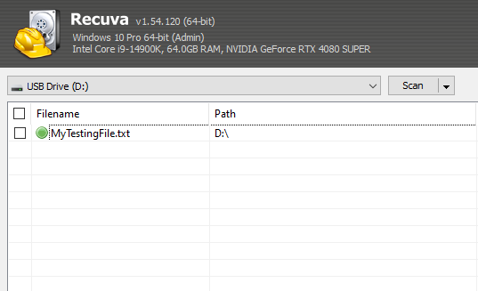
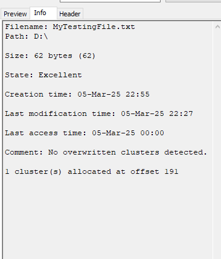

## File Recovery and Metadata Analysis using Recuva

### Introduction

This report documents the recovery of a deleted text file called "MyTestingFile" from a removable drive (D) using recuva. We will also be analyzing the files metadata to determine the file's history as it could have potential forensic relevance. 
### Recovery Method

#### Step 1: Installation and setup

1. Create a file and enter a sentence to verify file recovery integrity during the recovery process, in my case I called the text file "MyTestingFile".
2. Download recuva from the official site (https://www.ccleaner.com/recuva/download).
3. Install the application using the default installation settings.
4. Launch the application in administrator 
#### Step 2: File Recovery Process

1. In Recuva's welcome wizard, selected "Specific file type" option.
2. Selected "All Files" to ensure the target file would be included in the scan.
3. Set the location to "In a specific location" and browsed to Drive D.
4. Initiate the scan.
#### Step 3: File Identification:

1. After the scan is complete, filter the results by file type or  by name using the searchbox.

1. Locate the file in the results list, you can use the filename  and path detailed in the list
						*in my case this is denoted by 
						"- Filename: MyTestingFile
						 - Path: D:\MyTestingFile"
		
#### Step 4: File Recovery:

1. Selected the "MyTestingFile" by checking the box next to it.
2. Clicked "Recover" button.
3. Selected a recovery location on a different drive (to prevent overwriting potential evidence).
4. Successfully recovered the file to the specified location.
### Metadata Analysis
#### File Information

- **Filename:** MyTestingFile
- **File Type:** .txt
- **File Size:** 62 bytes

#### Temporal Metadata

- **Creation Date:** 2025-03-05 22:55
- **Last Modified Date:** 2025-03-05 22:27
- **Last Accessed:** 2025-03-05 00:00
## Forensic Relevance Assessment

### Analysis Conclusions and findings

1. The file creation timestamp (22:55) is actually later than the last modification time (22:27), which is unusual and could indicate potential timestamp manipulation or system clock issues.
2. Both the creation and modification timestamps occurred on the same day (March 5, 2025), suggesting this is a recently created file.
3. The last access date shows only the date (March 5, 2025) without specific time, which is consistent with how some file systems record access times.
4. The excellent recovery status indicates the file clusters had not been overwritten, suggesting recent deletion, which is consistent with the claim that it was made and modified on the same day.

### Investigative Relevance

This recovered file may hold significant value in the current investigation for the following reasons:

1. **Timeline Anomaly:** The unusual timestamp pattern (modification time earlier than creation time), is likely due to the following: 
		A. The file was originally created at some point before 22:27
		B. It was modified at 22:27
		C. The file was deleted
		D. At 22:55, the file was recovered/restored
		E. This recovery operation assigned a new creation timestamp (22:55) while preserving the earlier modification timestamp (22:27) 
2. **Same-Day Activity:** All recorded timestamps are from March 5, 2025, indicating the file was created, modified, accessed, and likely deleted all on the same day.
3. **Deliberate Removal:** The clean deletion status without cluster overwriting suggests an intentional deletion rather than system error or automated cleanup.
4. **Data Integrity:** The excellent recovery status suggests complete recovery of file contents, ensuring the integrity of any evidence contained within.